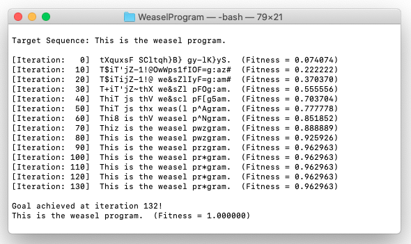

# Weasel Program
Modified implementation of the [weasel program]() described by Richard Dawkins in the third chapter of [The Blind Watchmaker](https://en.wikipedia.org/wiki/The_Blind_Watchmaker).

<p align="center">
    
</p>

## Installation

Run the following command to compile the code:

```bash
make
```


## Usage

Run the weasel program as:

```bash
./bin/weasel_program
```